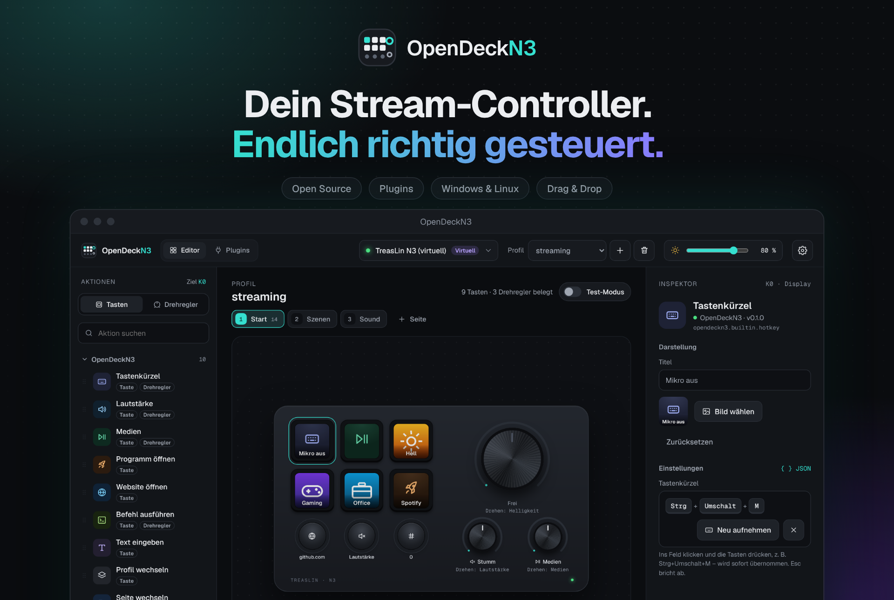
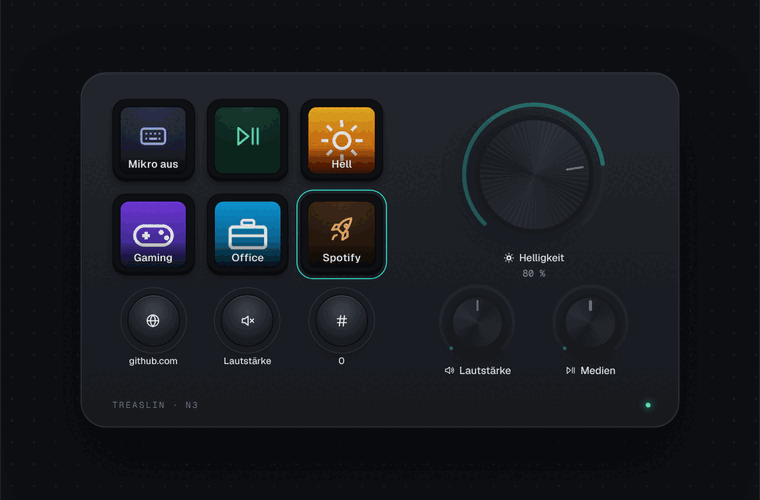
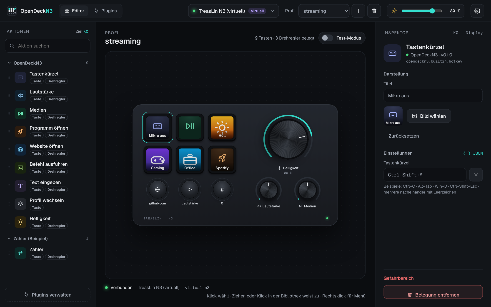
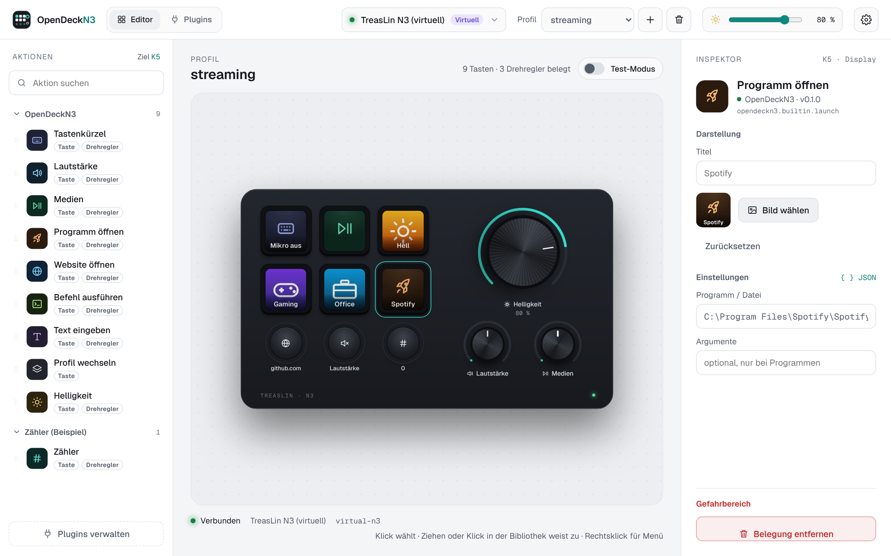
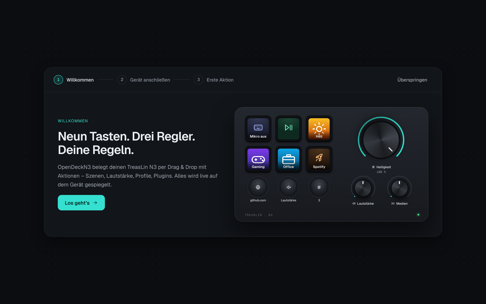
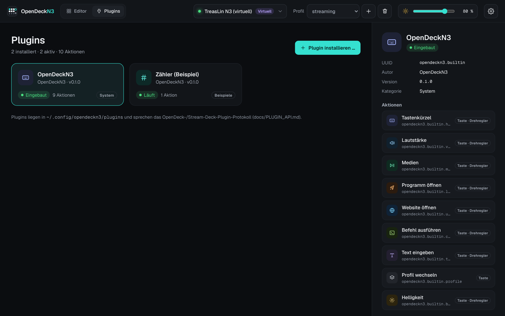

<a href="README.md">English</a> · <b>Deutsch</b>

  

  
  
  
  

  <b>Neun Tasten. Drei Regler. Deine Regeln.</b> 
  OpenDeckN3 macht aus deinem <b>TreasLin N3</b> ein richtiges Werkzeug – mit einer App, die Spaß macht, 
  Profilen für jede Situation und Plugins für alles, was dir einfällt. Kostenlos und Open Source.

  

---

## ✨ So fühlt es sich an

  

Drück eine Taste, dreh am Regler – die App zeigt es **in Echtzeit**. Was auf deinem Gerät leuchtet,
siehst du genauso in der Vorschau. Keine Überraschungen, kein Rätselraten.

## 🚀 Warum OpenDeckN3?

<table>
  <tr>
    <td width="33%" valign="top">
      <h3>🖱️ Drag &amp; Drop</h3>
      Aktion aus der Bibliothek greifen, auf eine Taste ziehen, fertig. Passt eine Aktion nicht auf einen Drehregler, sagt dir die App das schon beim Ziehen.
    </td>
    <td width="33%" valign="top">
      <h3>🗂️ Profile und Seiten</h3>
      Streaming, Gaming, Office – jedes Profil hat seine eigene Belegung, auf so vielen Seiten wie du brauchst. Umschalten und Blättern per Klick, Taste oder Drehregler.
    </td>
    <td width="33%" valign="top">
      <h3>🎨 Dein Look</h3>
      Eigene Bilder und Titel für jede Taste, Dark &amp; Light Mode und eine Vorschau, die aussieht wie dein echtes Gerät.
    </td>
  </tr>
  <tr>
    <td valign="top">
      <h3>🔌 Plugins</h3>
      Erweiterbar über Plugins im bewährten Stream-Deck-Stil – per Klick aus dem Katalog, direkt von GitHub oder als Datei installiert. Eigene Aktionen schreibst du in JavaScript, Python oder jeder anderen Sprache.
    </td>
    <td valign="top">
      <h3>🪟 Immer da, nie im Weg</h3>
      Echte Desktop-App mit Symbol im Infobereich. Fenster zu – OpenDeckN3 läuft leise weiter. Auf Wunsch startet es mit Windows.
    </td>
    <td valign="top">
      <h3>🔒 Lokal &amp; privat</h3>
      Kein Konto, keine Cloud, kein Tracking. Alles bleibt auf deinem Rechner – und der Code ist offen für alle.
    </td>
  </tr>
</table>

## 🧰 Schon alles an Bord

Kein Plugin-Gebastel für die Basics – diese Aktionen sind direkt eingebaut und in Sekunden eingerichtet:

| | Aktion | Auf der Taste | Am Drehregler |
| :---: | --- | --- | --- |
| ⌨️ | **Tastenkürzel** | Jede Kombination – einfach drücken, die App nimmt sie auf | Eigenes Kürzel je Drehrichtung |
| 🔊 | **Lautstärke** | Lauter, leiser oder stumm | Drehen regelt, Drücken schaltet stumm |
| ⏯️ | **Medien** | Play/Pause, vor, zurück, Stopp | Drehen wechselt den Titel |
| 🚀 | **Programm öffnen** | Apps, Dateien und Ordner starten | ✓ |
| 🌐 | **Website öffnen** | Deine Lieblingsseiten auf Knopfdruck | ✓ |
| 💻 | **Befehl ausführen** | Für Power-User: jede Kommandozeile | Eigener Befehl je Drehrichtung |
| 📝 | **Text eingeben** | Signaturen, E-Mail-Adressen, Textbausteine | ✓ |
| 🗂️ | **Profil wechseln** · ☀️ **Helligkeit** | Ein Knopf, ein neues Layout | Helligkeit stufenlos |
| 📑 | **Seite wechseln** | Nächste, vorige oder eine bestimmte Seite | Durch die Seiten blättern |

Und das Beste: Jede Taste zeigt auf dem Display, was sie tut – mit dem echten App-Icon oder Spiele-Cover und auf Wunsch einem eigenen Titel.

## 🖼️ Einblicke

  
  

Der Editor – im Dark und Light Mode. Links die Aktionen, in der Mitte dein Gerät, rechts alle Details zur gewählten Taste.

  
  

Ein kurzer Assistent beim ersten Start – und alle Plugins auf einen Blick.

## ⚡ In 3 Schritten startklar

| | |
| :---: | --- |
| **1** | **Herunterladen** – den Installer unter [Releases](https://github.com/Diddlik/OpenDeckN3/releases) holen. Keine Admin-Rechte nötig. |
| **2** | **Installieren &amp; starten** – OpenDeckN3 öffnet sich und begrüßt dich mit einem kurzen Assistenten. |
| **3** | **Loslegen** – TreasLin N3 anstecken, Aktionen auf die Tasten ziehen, fertig. |

> 💡 **Noch kein Gerät zur Hand?** Einfach „Virtuelles Gerät verwenden“ wählen und alles ausprobieren –
> Tasten drückst du per Klick, Regler drehst du mit dem Mausrad.

## 🎛️ Unterstützte Geräte

| Gerät | Status |
| --- | --- |
| **TreasLin N3** – 6 Display-Tasten, 3 Tasten, 3 Drehregler | ✅ unterstützt |
| Weitere Geräte der N3-Familie (Mirabox N3, Ajazz AKP03 …) | 🔜 geplant |

## 🗺️ Was als Nächstes kommt

- [x] Desktop-App mit Tray, Autostart, Installer und automatischen Updates
- [x] Profile, eigene Bilder, Plugins, virtuelles Testgerät
- [x] Mehrere Seiten pro Profil – wechseln per Taste oder Drehregler
- [x] Plugins aktualisieren sich automatisch (abschaltbar)
- [x] Titel direkt auf den Tasten-Displays
- [x] Eingebaut: Tastenkürzel, Lautstärke, Medien, Programme, Websites, Befehle, Text
- [x] Plugins per Klick installieren – aus Datei oder direkt aus GitHub-Releases
- [x] Discord-Plugin: Mikro, Kopfhörer, Kanäle, Lautstärken, Soundboard, Kamera, Bildschirmfreigabe
- [x] OBS-Studio-Plugin: Aufnahme mit Laufzeit, Stream, Szenen, Quellen, Filter, Audio, Makros
- [x] Home-Assistant-Plugin: Webhooks, Dienste, Schalter, Dimmer, Zustände
- [ ] Multi-Aktionen und Ordner
- [ ] Automatischer Profilwechsel je nach aktivem Programm
- [ ] Weitere Geräte

Ideen oder Wünsche? [Erzähl uns davon!](https://github.com/Diddlik/OpenDeckN3/issues)

## ❓ Häufige Fragen

<b>Windows warnt beim Installieren – ist das normal?</b>

Ja. Der Installer ist (noch) nicht digital signiert, deshalb zeigt Windows SmartScreen eine Warnung.
Klicke auf <i>„Weitere Informationen“ → „Trotzdem ausführen“</i>.

<b>Mein Gerät wird nicht erkannt.</b>

Schließe die Hersteller-Software des N3, falls sie läuft – es kann immer nur ein Programm mit dem Gerät sprechen.
Unter Linux braucht OpenDeckN3 einmalig Zugriffsrechte (die App zeigt dir den passenden Befehl).

<b>Läuft OpenDeckN3 auch unter Linux?</b>

Ja, OpenDeckN3 funktioniert unter Linux – aktuell noch über den Quellcode. Fertige Pakete folgen.
Wie das geht, steht in der <a href="docs/ENTWICKLUNG.md">Entwickler-Doku</a>.

<b>Wie bekomme ich Updates?</b>

Automatisch: OpenDeckN3 schaut beim Start und alle paar Stunden nach einer neuen Version und fragt dich, bevor etwas passiert.
Ein Klick auf <i>„Jetzt aktualisieren“</i> lädt das Update, prüft es und startet die App neu – deine Profile bleiben erhalten.
In den <i>Einstellungen → Updates</i> kannst du auch selbst suchen, Vorabversionen ausschalten oder <i>„App automatisch
aktualisieren“</i> einschalten – dann wird ohne Nachfrage installiert.
Plugins aus dem Katalog halten sich von selbst aktuell; das lässt sich dort mit <i>„Plugins automatisch aktualisieren“</i> abschalten.

<b>Wo liegen meine Profile?</b>

Unter Windows in <code>%APPDATA%\opendeckn3</code>, unter Linux in <code>~/.config/opendeckn3</code>.
Sie bleiben auch bei einer Deinstallation erhalten. In der App: <i>Einstellungen → Konfigurationsordner → Öffnen</i>.

<b>Kostet OpenDeckN3 etwas?</b>

Nein. OpenDeckN3 ist freie Software unter der GPL-3.0 – kostenlos, ohne Werbung, ohne Abo.

## 🛠️ Für Entwickler

Du willst Plugins schreiben, mitbauen oder schauen, wie alles funktioniert?
Alles Technische findest du in der **[Entwickler-Doku](docs/ENTWICKLUNG.md)** – von der
[Architektur](docs/ARCHITEKTUR.md) über die [Plugin-Schnittstelle](docs/PLUGIN_API.md) bis zum [Projektziel](docs/VORHABEN.md).

## 💚 Danke

OpenDeckN3 steht auf den Schultern großartiger Projekte:
[OpenDeck](https://github.com/nekename/OpenDeck), [opendeck-akp03](https://github.com/4ndv/opendeck-akp03),
[mirajazz](https://github.com/4ndv/mirajazz) und [Tauri](https://tauri.app).

Mit ❤️ gebaut · <a href="LICENSE">GPL-3.0-or-later</a>

