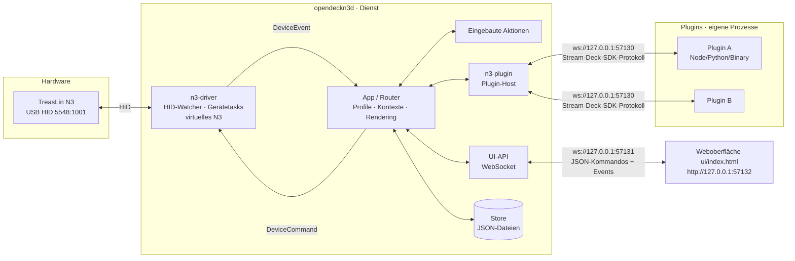

# Architektur

## Überblick



## Crates

| Crate | Aufgabe | Wichtige Typen |
| --- | --- | --- |
| `n3-core` | Domänenmodell ohne I/O | `DeviceInfo`, `DeviceLayout`, `InputEvent`, `DeviceCommand`, `DeviceEvent`, `DeviceHandle`, `Profile`, `ActionInstance`, `SlotContext` |
| `n3-driver` | Hardware: Modelltabelle, N3-Protokoll (über `mirajazz`), Hot-Plug, virtuelles Gerät | `models::SUPPORTED_MODELS`, `n3::process_input`, `run_hid_watcher`, `virtual_deck::run_virtual_device` |
| `n3-plugin` | Plugin-Manifest, Protokoll, WebSocket-Server, Prozessverwaltung | `PluginHost`, `PluginManifest`, `InboundEvent`, `protocol::SlotRef` |
| `n3-desktop` | Desktop-App (Tauri 2): Fenster mit `ui/index.html`, Tray, Autostart, Single-Instance; startet den Dienst im selben Prozess, Log nach `<config>/opendeckn3.log` | `main.rs` |
| `n3-daemon` | Bibliothek (`run(Options, shutdown)`) + CLI `opendeckn3d`: verdrahtet alles, Router, Store, UI-API, eingebaute Aktionen, liefert die Weboberfläche aus | `App`, `Store`, `ApiCommand`, `ui_server` |

## Laufzeitmodell

- **Ein Event-Loop besitzt den gesamten Zustand** (`App` in `n3-daemon/src/app.rs`). Treiber,
  Plugin-Verbindungen und UI-Clients laufen als eigene tokio-Tasks und kommunizieren nur über Kanäle:
  - `mpsc<DeviceEvent>`: Treiber → App (Verbunden, Getrennt, Eingabe)
  - `mpsc<DeviceCommand>` je Gerät: App → Treiber (Bild setzen, Helligkeit, alles löschen)
  - `mpsc<PluginMessage>`: Plugin-Host → App (Registriert, Getrennt, eingehende Events)
  - `mpsc<ApiRequest>` + `oneshot`: UI-Client → App (Kommando + Antwort)
  - `broadcast<Value>`: App → alle UI-Clients (Live-Events)
- Dadurch braucht die Geschäftslogik **keine Locks** und ist leicht testbar.

### Gerätetask (N3)

Jedes Gerät läuft auf einem eigenen Betriebssystem-Thread mit eigener (single-threaded) Tokio-Runtime.
Grund: Windows bricht laufende HID-Leseoperationen ab (`ERROR_OPERATION_ABORTED`), wenn der Thread endet,
der sie gestartet hat – auf einem gemeinsamen Thread-Pool kann das passieren. Darin laufen zwei nebenläufige
Schleifen (`n3-driver/src/n3.rs`):

1. **Leseschleife** – liest HID-Reports, übersetzt sie per `process_input` in `InputEvent`s.
2. **Kommandoschleife** – setzt Bilder/Helligkeit und sendet alle 15 s ein Keep-Alive.

Endet eine der Schleifen mit Fehler (z. B. Gerät abgezogen) oder wird der Task abgebrochen,
meldet der Task `Disconnected`. Der Watcher startet beim erneuten Anstecken einen neuen Task – und sucht
zusätzlich alle 3 s nach Geräten, deren Verbindung ohne Abstecken abgebrochen ist, und verbindet sie neu.
Ließ sich ein Gerät gar nicht öffnen (z. B. von der Hersteller-Software belegt), wartet er damit 10 s.

## Datenfluss-Beispiele

**Tastendruck:** N3 → HID-Report `0x03` → `KeyDown{key:2}` → App sucht Instanz im aktiven Profil
→ eingebaute Aktion *oder* `keyDown`-Event an das zuständige Plugin → UI erhält `input`-Event.

**Plugin setzt Bild:** Plugin → `setImage{context, image:dataURL}` → App prüft, dass der Kontext
dem Plugin gehört und zum aktiven Profil passt → dekodiert Bild → `DeviceCommand::SetKeyImage`
→ Treiber skaliert/rotiert/kodiert als 64×64 JPEG → UI erhält `keyImage` mit PNG-Vorschau.

**Profilwechsel:** `willDisappear` für alle alten Instanzen → Profil laden → `willAppear` für alle
neuen Instanzen → alle Display-Tasten mit Standardbild neu zeichnen → UI erhält `profileChanged`.

**Seitenwechsel:** wie der Profilwechsel, nur innerhalb des Profils (UI erhält `pageChanged`). Ein Profil
öffnet immer auf Seite 1. Wer eine Taste noch hält, während die Seite wechselt, löst beim Loslassen nichts auf
der neuen Seite aus (`keyUp` wird verworfen).

**Plugin-Updates:** Der `Installer` prüft 60 s nach dem Start und dann alle 6 Stunden den Katalog und
installiert neuere Versionen, solange `autoUpdatePlugins` in `settings.json` gesetzt ist (Standard).

## Eingebaute Aktionen & Tastenbilder

- `n3-daemon/src/builtin.rs`: Katalog mit `settingsSchema`, Standardwerte und Icon je Aktion, Auswertung der
  Eingaben (`effect`) – getrennt von der Ausführung, damit die Logik ohne Desktop testbar ist.
- `n3-daemon/src/system/`: Seiteneffekte auf dem Rechner – `shortcut` (Parser für `Ctrl+Shift+M`), `input` (eigener Thread mit
  `enigo`: SendInput unter Windows, X11 unter Linux), `launch` (Programme, Dateien, Shell-Befehle ohne Konsolenfenster).
  Fehler landen als UI-Event `actionError` beim Nutzer.
- Tastenbilder werden in `render::compose_key` zusammengesetzt (144 px): Bild (Nutzer → Plugin zur Laufzeit → Zustandsbild →
  Icon) plus Titel (Nutzer → Plugin; ohne Titel nur das Bild), gezeichnet mit eingebetteter Schrift
  Geist (OFL, `assets/fonts/`). Icons der eingebauten Aktionen: `assets/builtin/`, erzeugt mit `tools/make-builtin-icons.cjs`
  aus den Icons der Oberfläche.

## Updates (Desktop-App)

`n3-desktop/src/updater.rs` fragt `api.github.com/repos/Diddlik/OpenDeckN3/releases` ab (beim Start nach 8 s und alle
6 h, gesteuert von der Oberfläche; Vorabversionen optional). Ist ein Release neuer als die App-Version, zeigt die UI einen
Dialog. „Jetzt aktualisieren“ lädt `…-windows-x64-setup.exe` (nur von `github.com/Diddlik/OpenDeckN3/releases/download/`),
prüft ihn gegen `SHA256SUMS.txt` aus demselben Release und startet ihn mit `/P /UPDATE /R` (Fortschrittsfenster, keine neuen
Verknüpfungen, Neustart danach) – dieselben Schalter wie Tauris eigener Updater. Die App beendet sich vorher selbst.
`SHA256SUMS.txt` erzeugt der Release-Workflow; Releases ohne diese Datei werden nicht automatisch installiert.

## Plugins installieren

`n3-daemon/src/plugin_install.rs` beantwortet `installPlugin` und `pluginStore` in eigenen Tasks (Netzwerk und Entpacken
blockieren den Haupt-Loop nicht): Es lädt `registry.json` (Standard: `plugins/registry.json` auf `main`, per
`--plugin-registry` änderbar) und je Eintrag die Releases über `api.github.com`, wählt das passende Asset
(`.streamDeckPlugin`/`.zip`, Plattform-Token wie `windows`/`linux`/`mac` im Namen), lädt es und entpackt es nach
`<config>/plugins/.staging/`. Das Aktivieren – alten Prozess stoppen, Ordner ersetzen, `PluginHost::add` +
`start_plugin` – erledigt `App` über das interne Kommando `ActivatePlugin` im Haupt-Loop. Installierte Plugins
(Benutzerverzeichnis, zuletzt gescannt) haben Vorrang vor mitgelieferten mit gleicher UUID.

## Persistenz

Konfigurationsverzeichnis (Standard `~/.config/opendeckn3`, per `--config-dir` änderbar):

```text
devices/<geräte-id>/device.json            { activeProfile, brightness }
devices/<geräte-id>/profiles/<profil>.json Profil mit pages: [{ name, keys, encoders }] → ActionInstance
                                           (alte Dateien mit keys/encoders oben werden zu Seite 1)
settings.json                              { autoUpdatePlugins } – Einstellungen des Dienstes
plugin-settings/<plugin-uuid>.json         globale Plugin-Einstellungen
plugins/<plugin>.sdPlugin/                 installierte Plugins (Standard-Plugin-Verzeichnis)
```

Dateien werden atomar geschrieben (temporäre Datei + Rename).

## Ports

| Port | Zweck |
| --- | --- |
| `57130` | Plugin-WebSocket (Stream-Deck-SDK-Protokoll) |
| `57131` | UI-API-WebSocket (nur erlaubte Browser-Origins, siehe UI_API.md) |
| `57132` | Weboberfläche (eingebettetes `ui/index.html`) |

Alle binden nur an `127.0.0.1` und sind per CLI änderbar (`--plugin-port`, `--api-port`, `--ui-port`).

## Erweiterungspunkte

- **Neues Gerät:** Eintrag `ModelSpec` in `n3-driver/src/models.rs` (VID/PID, Protokollversion,
  Bildformat, Layout, Input-Mapping) und in `SUPPORTED_MODELS` aufnehmen; udev-Regel ergänzen.
- **Neue eingebaute Aktion:** `n3-daemon/src/builtin.rs` – Katalogeintrag + Behandlung in `on_input`.
- **Neues Plugin-Event:** Variante in `n3-plugin/src/protocol.rs::InboundEvent` + Behandlung in `App::on_plugin_event`.
- **Neues UI-Kommando:** Variante in `n3-daemon/src/api.rs::ApiCommand` + `App::on_api_command`, in `docs/UI_API.md` dokumentieren.

## Offene technische Punkte

- SVG-Bilder von Plugins werden noch nicht unterstützt.
- Plugin-Prozesse werden nach Absturz nicht automatisch neu gestartet.
- Physische Lage der Drehregler/Tasten am Gerät mit echter Hardware verifizieren (siehe Gerätedoku).
