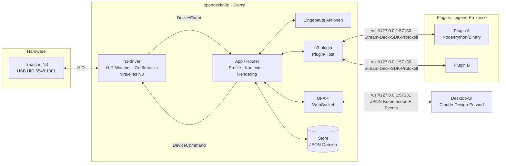

# Architektur

## Überblick



## Crates

| Crate | Aufgabe | Wichtige Typen |
| --- | --- | --- |
| `n3-core` | Domänenmodell ohne I/O | `DeviceInfo`, `DeviceLayout`, `InputEvent`, `DeviceCommand`, `DeviceEvent`, `DeviceHandle`, `Profile`, `ActionInstance`, `SlotContext` |
| `n3-driver` | Hardware: Modelltabelle, N3-Protokoll (über `mirajazz`), Hot-Plug, virtuelles Gerät | `models::SUPPORTED_MODELS`, `n3::process_input`, `run_hid_watcher`, `virtual_deck::run_virtual_device` |
| `n3-plugin` | Plugin-Manifest, Protokoll, WebSocket-Server, Prozessverwaltung | `PluginHost`, `PluginManifest`, `InboundEvent`, `protocol::SlotRef` |
| `n3-daemon` | Binary `opendeckn3d`: verdrahtet alles, Router, Store, UI-API, eingebaute Aktionen | `App`, `Store`, `ApiCommand` |

## Laufzeitmodell

- **Ein Event-Loop besitzt den gesamten Zustand** (`App` in `n3-daemon/src/app.rs`). Treiber,
  Plugin-Verbindungen und UI-Clients laufen als eigene tokio-Tasks und kommunizieren nur über Kanäle:
  - `mpsc<DeviceEvent>`: Treiber → App (Verbunden, Getrennt, Eingabe)
  - `mpsc<DeviceCommand>` je Gerät: App → Treiber (Bild setzen, Helligkeit, alles löschen)
  - `mpsc<PluginMessage>`: Plugin-Host → App (Registriert, Getrennt, eingehende Events)
  - `mpsc<ApiRequest>` + `oneshot`: UI-Client → App (Kommando + Antwort)
  - `broadcast<Value>`: App → alle UI-Clients (Live-Events)
- Dadurch braucht die Geschäftslogik **keine Locks** und ist leicht testbar.

### Gerätetask (N3)

Pro Gerät laufen zwei nebenläufige Schleifen (`n3-driver/src/n3.rs`):

1. **Leseschleife** – liest HID-Reports, übersetzt sie per `process_input` in `InputEvent`s.
2. **Kommandoschleife** – setzt Bilder/Helligkeit und sendet alle 15 s ein Keep-Alive.

Endet eine der Schleifen mit Fehler (z. B. Gerät abgezogen) oder wird der Task abgebrochen,
meldet der Task `Disconnected`. Der Watcher startet beim erneuten Anstecken einen neuen Task.

## Datenfluss-Beispiele

**Tastendruck:** N3 → HID-Report `0x03` → `KeyDown{key:2}` → App sucht Instanz im aktiven Profil
→ eingebaute Aktion *oder* `keyDown`-Event an das zuständige Plugin → UI erhält `input`-Event.

**Plugin setzt Bild:** Plugin → `setImage{context, image:dataURL}` → App prüft, dass der Kontext
dem Plugin gehört und zum aktiven Profil passt → dekodiert Bild → `DeviceCommand::SetKeyImage`
→ Treiber skaliert/rotiert/kodiert als 64×64 JPEG → UI erhält `keyImage` mit PNG-Vorschau.

**Profilwechsel:** `willDisappear` für alle alten Instanzen → Profil laden → `willAppear` für alle
neuen Instanzen → alle Display-Tasten mit Standardbild neu zeichnen → UI erhält `profileChanged`.

## Persistenz

Konfigurationsverzeichnis (Standard `~/.config/opendeckn3`, per `--config-dir` änderbar):

```text
devices/<geräte-id>/device.json            { activeProfile, brightness }
devices/<geräte-id>/profiles/<profil>.json Profil mit keys/encoders → ActionInstance
plugin-settings/<plugin-uuid>.json         globale Plugin-Einstellungen
plugins/<plugin>.sdPlugin/                 installierte Plugins (Standard-Plugin-Verzeichnis)
```

Dateien werden atomar geschrieben (temporäre Datei + Rename).

## Ports

| Port | Zweck |
| --- | --- |
| `57130` | Plugin-WebSocket (Stream-Deck-SDK-Protokoll) |
| `57131` | UI-API-WebSocket |

Beide binden nur an `127.0.0.1` und sind per CLI änderbar (`--plugin-port`, `--api-port`).

## Erweiterungspunkte

- **Neues Gerät:** Eintrag `ModelSpec` in `n3-driver/src/models.rs` (VID/PID, Protokollversion,
  Bildformat, Layout, Input-Mapping) und in `SUPPORTED_MODELS` aufnehmen; udev-Regel ergänzen.
- **Neue eingebaute Aktion:** `n3-daemon/src/builtin.rs` – Katalogeintrag + Behandlung in `on_input`.
- **Neues Plugin-Event:** Variante in `n3-plugin/src/protocol.rs::InboundEvent` + Behandlung in `App::on_plugin_event`.
- **Neues UI-Kommando:** Variante in `n3-daemon/src/api.rs::ApiCommand` + `App::on_api_command`, in `docs/UI_API.md` dokumentieren.

## Offene technische Punkte

- Titel-Rendering (Schrift auf Tastenbild) fehlt – Titel werden bisher nur an die UI gemeldet.
- SVG-Bilder von Plugins werden noch nicht unterstützt.
- Plugin-Prozesse werden nach Absturz nicht automatisch neu gestartet.
- Physische Lage der Drehregler/Tasten am Gerät mit echter Hardware verifizieren (siehe Gerätedoku).
